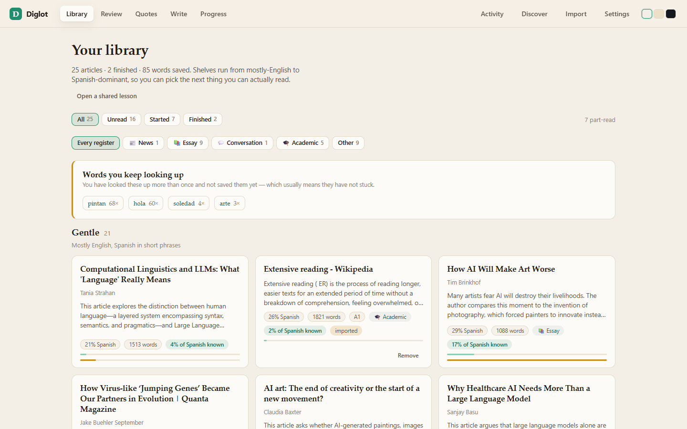
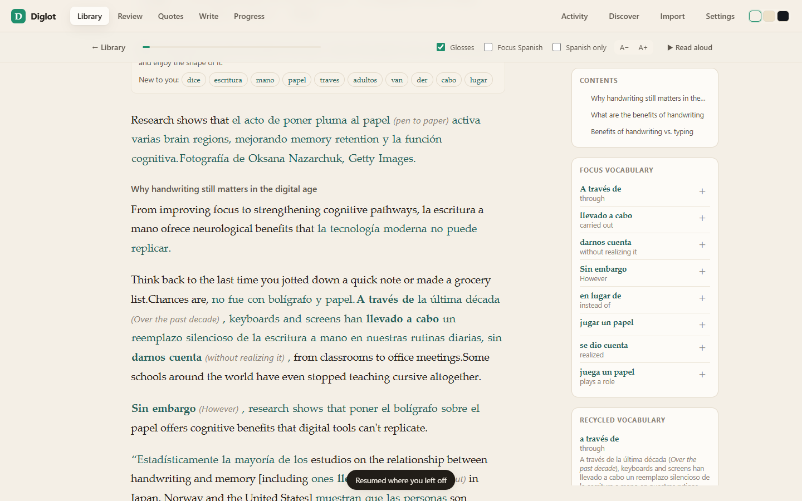
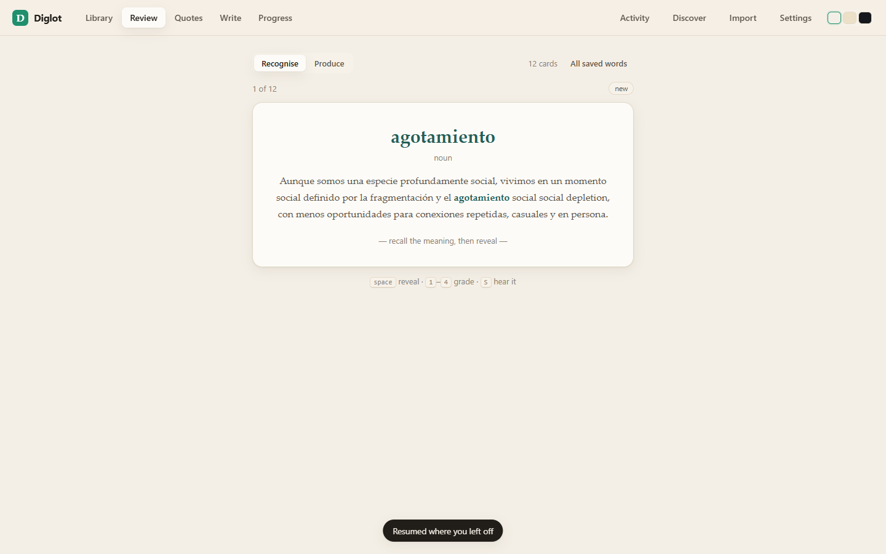
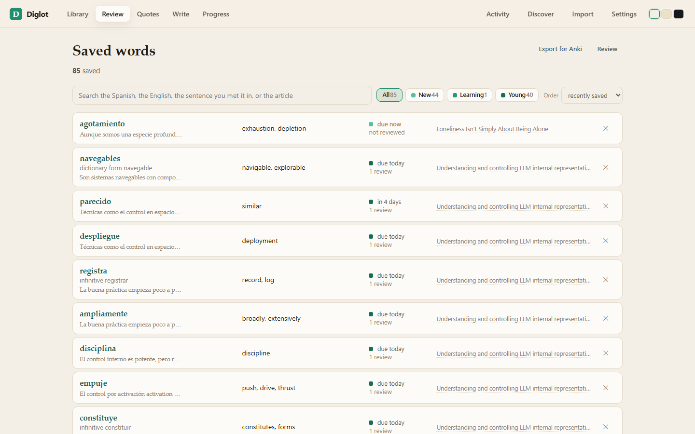
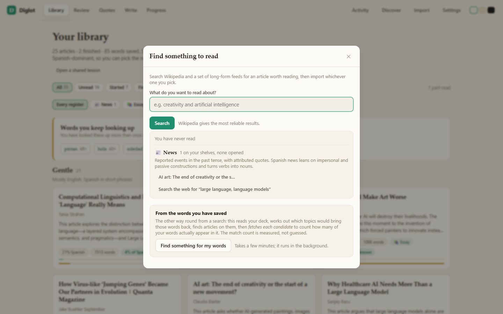
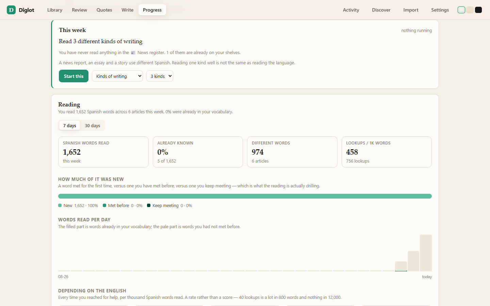

# Diglot

A reading-first app for learning Spanish from English.

It reads **diglot** texts — articles where Spanish is woven into English prose,
each Spanish phrase carrying an English gloss, the lesson's vocabulary in bold —
and turns them into something you can actually study from: click any Spanish
word for a dictionary entry, save it, get it back later in spaced repetition,
and test yourself by translating sentences that are graded on *meaning* rather
than string-matched against an answer key.

It also **makes its own lessons**. Point it at any article on the web and it
weaves that article into a diglot, with a recycled vocabulary box and a grammar
breakdown, in the same Markdown format as the hand-made corpus it ships with.



---

## Running it

**Double-click `Open Diglot.vbs`.** That is the way to run this if you are not a
developer: it starts the app with `pythonw`, which has no console, waits for it to
answer, and opens it in your browser. Nothing flashes up and no terminal stays open.
The app's log goes to `data/app.log` — the one place to look when something does not
start. If the app is already running, it just opens the page.

From a terminal, if you prefer:

```bash
pip install -r requirements.txt
python run.py                     # http://127.0.0.1:8787
pythonw run.py --log data/app.log # the same thing the launcher does
```

Keys come from the **Settings** panel in the app (see below), then from the first
`.env` found: this project's, then a machine-wide one if you keep one.

```
TYPESAFE_API_KEY=...     # optional: graded exercises (TypeSafe System One / Jev)
TYPESAFE_MODEL=jev-latest

LLM_BASE_URL=...         # glosses, quizzes, weaving (any OpenAI-compatible endpoint)
LLM_API_KEY=...
LLM_MODEL=...

DIGLOT_CORPUS=/path/to/your/own/diglot/articles  # optional; ./corpus by default
DIGLOT_PROXY=http://127.0.0.1:7890               # optional; only if your network needs one
```

**Both AI tiers are optional.** With neither configured the app still reads,
segments, measures your vocabulary and schedules reviews. Glosses, exercises
and import switch off, and say so, rather than failing.

**A corpus is optional too, and one sample passage ships with the app** in
`corpus/`, so a fresh clone has something to open immediately. That folder is where
your own lessons go — hand-made ones, or the ones this app imports for you — and
`DIGLOT_CORPUS` points somewhere else if you keep them elsewhere. Nothing in the app
needs it: every lesson it makes is written to `data/library/`, and the two shelves
are read as one.

### Settings

**Settings** in the top bar is where the model key goes — no file editing, and no
restart. A base URL, a model name and a key; saving rebuilds the app's model
connection there and then, and tells you whether it worked. The app works without
one (reading, saving words and review need no model at all), and says which of the
two tiers is missing rather than failing later.

What you set here is written to `data/settings.json` and **wins over the `.env`**:
the `.env` is how the machine is configured, this is how the person using it is.
*Forget the key* clears it and hands the value back to the `.env` — clearing means
"forget this", not "use an empty one", because clearing is how you undo a typo.

**The key never goes back to the browser.** The panel is told whether one is set and
a four-character hint that identifies which key it is, and the endpoint reports the
same. Keys are marked `repr=False` in the settings type, so a traceback or a log
line cannot print one either.

---

## What it does

### Read



- The weave is rendered as two languages, not one text with foreign words in it:
  English in warm near-black, Spanish in a deep teal, focus words bold, glosses
  in muted italic.
- **Difficulty is a dial you control**: hide the glosses, fade the English, or
  hide the English entirely and read only the Spanish.
- Click any Spanish word for a dictionary entry that knows the *form* it is in —
  `se volverá` resolves to `volverse`, future tense — plus an example and a note
  on what learners get wrong about it.
- **Lookups are instant for anything the corpus already translates.** The
  diglot articles carry the author's own glosses, and the post-reading
  vocabulary box is effectively a morphology table (`volverse / se vuelva, se
  volverá` · *to become*). All of it is indexed at startup into a local glossary
  that ships to the browser, so clicking a word the lesson taught needs no
  request and no model call. Words the corpus never translated are resolved
  ahead of the click: opening an article warms its unresolved vocabulary in the
  background, bare bolded focus phrases first.
- Any word the corpus answered still has a **✨ Full entry** button, which asks
  the tutor for the lemma, part of speech, example and learner's note. Instant by
  default, richer on request — and once fetched, the fuller entry is what you
  get next time.
- **💡 Explain** gives a short answer — what it means, the one grammar point that
  matters, the mistake worth avoiding — in about 60 words, not a lecture.
- **▶ Read aloud** plays the article a sentence at a time, switching voice
  between the languages inside each sentence — Spanish in a Spanish voice,
  English in an English one, the way a bilingual reader would read it. Served
  sentence by sentence rather than span by span, because a bolded word splits
  one Spanish sentence into several markup spans, and reading those in turn
  produced four utterances for one sentence, one of them the single word
  *pintan*.
- The **contents** pane lists the article's own sections and marks where you
  are, so a long imported piece is something you navigate rather than scroll
  through. An article with fewer than two sections simply doesn't show one.
  Imported lessons keep the source page's headings for exactly this reason — and
  the pane refuses the page's *furniture*: a heading that repeats in the same
  article (a "related links" box the extractor saw twice) is not navigation, and
  neither is a publication line or a "magazine | column" kicker. The body still
  shows what the file says; only the contents list declines to point at it.
- Clicking anywhere else dismisses the word panel. Clicking *another* word
  moves it, which is why the dismissal is bound on `mousedown`: one gesture has
  to close the old panel and open the new one.
- Words already in your deck are underlined as you read.
- Three themes (paper, sepia, night), adjustable text size, click-to-hear
  pronunciation, and your place in the article is remembered.
- The article says **what kind of writing it is** — news, essay, conversation,
  academic, fiction — and **who decided**: a passage that declares its own kind in
  its file is a fact about it, one the app read off the text is marked *inferred*.
  You can correct either from the reader, and the correction is written into the
  passage's own file rather than kept privately, so the file stops being wrong.
  (A passage inside a file that holds several — a compilation — says so instead of
  offering a button that cannot say which passage you meant.)

### Know what you can read

Before you open an article, the library tells you what share of its Spanish you
already know, and what that means:
> **94%** of the Spanish words here are already in your deck — a few new words
> per paragraph. This is the range where reading teaches most.
> *New to you: inacabado · tosco · pulir · acabado*

Coverage is measured, not estimated from article metadata. It matches
inflections (`volverse` ↔ `se vuelve`), sees through the reflexive clitic, and
normalises the stem-changing diphthongs that would otherwise break exactly the
verbs a learner most needs credit for.

### Review



- Spaced repetition (SM-2) with four ratings that show what each would do
  (`again 10m · hard 12h · good 1d · easy 4d`).
- Cards come back **in the sentence you met them in**, not as isolated pairs.
- **A conjugated word shows the form it belongs to.** Save `enfatizan` and the
  reveal gives you *they emphasise* **and** *infinitive enfatizar* — because
  recognising a word in one sentence is not the same as knowing the verb, and
  the lemma was already there from the lookup that saved it. Labelled by part of
  speech: a noun shows its dictionary form, not an infinitive, and a word already
  saved in that form shows nothing extra.
- Two modes: **Recognise** (see the Spanish, recall the meaning) and
  **Produce** (the word is blanked out of its own sentence and you type it back).
- **Words you keep looking up** are surfaced as a study list you did not have to
  build — a word looked up three times and never saved is the clearest signal
  the app has that it has not stuck.
- **Saved words** is the whole deck as a page, not a queue: every card you have,
  with the form it belongs to, the sentence you met it in, its stage, when it is
  next due, how many times you have seen it and how often it has slipped, and the
  article it came from. Searchable by any of that — the Spanish, the English, the
  sentence, the article — with accents folded, so `cuestion` finds `cuestión`.
  Filter by stage, order by A–Z, by what is due, or by *most forgotten*, hear any
  word, or remove it. It is reached from Review, because that is where you are
  looking when the question comes up.



### Keep sentences, not just words

Select anything in an article and press **Keep**. The sentence lands in
**Quotes**, and it costs no model call — it has to be free enough to do
mid-paragraph without breaking the reading.

The quote keeps the sentence as it read, with the Spanish and the English
separated underneath, and the word the lesson bolded labelled as what it is
teaching. A three-word selection widens to the whole sentence: half a sentence is
not something you want to be shown again later. A sentence with no Spanish in it
is refused, with the reason, because a collection is only useful if everything in
it is worth returning to.

Quotes are **searchable by any of it** — the Spanish, the English, the glosses,
your own note, the focus word — and accents are folded, so `cuestion` finds
`cuestión`. Look a word up while reading and the popover shows the sentences you
kept with it, which is what makes the collection live rather than a graveyard.

### Filter by what you have read

The library filters by read state — **All / Unread / Started / Finished** — with
a count on each, remembered between visits. Reaching the end of an article marks
it finished automatically; requiring a button press for that would leave the
Finished shelf empty for anyone who simply read the thing.

### Write

The one screen with a text box, because producing Spanish is the skill reading
alone cannot build — and a workspace rather than a form, because writing is a
loop: draft, read it back, revise, read it back.

**The prompt comes from your own material.** The words you keep looking up and
never save come first, then words you saved recently, then words from a sentence
you kept, with the topic taken from what you have been reading. It mixes two
words you struggle with and one you know, because a prompt made only of words you
cannot reach for is a prompt you do not finish.

**Typing is measured as you go** — words, sentences and **what share of it is
actually Spanish**, from the same segmenter the reader reads with. *"60% of this
is English"* is the most common thing wrong with a first attempt at free writing,
and it is a fact about the text rather than an opinion about it. Nothing reaches
the server until you check or keep it; the draft itself is autosaved in your
browser on every keystroke, so closing the tab never costs a paragraph.

**Check this draft** reads it and keeps it as a version. Before any model is
involved it has already measured the piece and reported which of the prompted
words you reached for. Then, if a model is configured:

- **the notes are placed on your text.** *Good*, *fix*, or *style* — green for
  what worked, red for what is wrong, amber for what would read better another
  way. Click any mark for the explanation. A note the tutor cannot quote exactly
  from your draft is dropped rather than shown in the wrong place, and at least
  one *good* note comes before any bad one.
- **a score with the dimensions kept apart** — *holds together*, *varied*, *did
  the prompt* — so "good Spanish that ignores what you asked for" is visible as
  such, plus one thing to try next.
- **Improve this**, in four flavours: fix the grammar only, make it sound native,
  make it richer, or **keep my words**. Each returns a suggested revision shown
  **beside** yours. Nothing is ever replaced on your behalf — taking a suggestion
  puts it in the box to edit, which makes it your draft and not a verdict.

**Every version you check is kept**, with the notes it earned, so going back to
Draft 1 shows what Draft 1 was told. Your pieces are listed by name — taken from
how each one opens, so nothing asks you to title your practice writing — and
opening one puts its latest version back in the box.

**Your own passage can become a lesson.** *Make a lesson* takes what is in the box
and weaves it into a diglot at the same three settings an import gets, then shelves
it in your library like anything else — same reader, same notes, same cards. The
piece does not have to be in English: it is put into English first (the format is
English prose with Spanish woven in), and for a piece you wrote in Spanish that
means your own sentences come back to you as the Spanish. A piece that is already
English is left exactly as you wrote it — the model is asked which language it is,
and only its answer is used — because paraphrasing someone's own writing to translate
it from English to English would be a strange thing to do to it. The draft is kept
as a version as part of the call, so the lesson refers back to something you can see.

**Open a file** reads a `.txt` or `.md` into the box, in the browser, so the text
never leaves your machine. Text formats only: a PDF or a `.docx` is not text, and
accepting one would mean failing confusingly without a parser.

With no model configured the measurements still appear and the app says plainly
that reviewing the piece needs one — a paragraph cannot be reviewed by counting
words, and it does not pretend otherwise.

### A goal for the week

The Progress view proposes one goal a week — *read 6,000 Spanish words*, *finish
3 articles*, *read on 5 different days* — and says **why that one**, because a
goal you cannot argue with is a chore. The app proposes and you decide; you can
pick a different kind and a different target, and one goal runs at a time,
because a list of goals is a list of things not done.

Nothing new is tracked to make this work. Every measurement comes from data the
app already keeps: the words you actually scrolled past, what you finished, the
per-day activity behind the chart, the register of each passage. A challenge that
needed its own counter would be a challenge that existed only to be measured.

The proposal is ordered by how invisible the failure is. A register gap comes
first — *you have never read a news report*, which no screen in the app would
otherwise tell you — then articles left half-read, then reading that happens in
bursts. When the week is up it is over: reported once, not nagged about.

### Reading analytics

The Progress view answers the question a reading app should be judged on: **is
the reading working?**

> **You read 12,400 Spanish words across 6 articles this week. 83% were already
> in your vocabulary.**

- **Vocabulary exposure** — words read, how many you already knew, how many were
  distinct, and a split into *new* / *met before* / *keep meeting*, which is what
  the reading is actually drilling. Plus a daily chart of words read with the
  known portion filled in.
- **Scaffolding dependence** — lookups, full-entry requests, explanations,
  translations and glosses turned back on, each as a rate per 1,000 words read.
  A rate rather than a score: 40 lookups is a lot in 800 words and nothing in
  12,000.
- **Words you keep meeting** — read repeatedly, not yet in your deck, one click
  to save.

Two definitions are load-bearing and are pinned by tests. **"Understood" means
already in your deck**, not "did not click" — silence is not comprehension. And
**function words are excluded everywhere**, because they are most of any Spanish
text and none of what anyone is learning.

None of this runs on the reading path. Words are credited from the periodic
progress save the reader was already making, and the scaffolding counts come
from endpoints that were already recording events. **Nothing was added to the
word-lookup path**, which is where latency would actually be felt.

### The passage map

Every article as a node, joined when they share vocabulary — so the graph tells
you which passage prepares you for which, not merely which are about similar
things. Node size is length, colour is the group the layout found, and the ring is
how much of it you already know, which makes the map double as "what can I read
next". Click a group in the legend and the map keeps only that group.

Rare words count for more than common ones, and the first version *had* to be
rebuilt because of it: with every word weighted equally, every pair of passages
shared at least two words, 268 of 276 possible edges survived, and the layout
collapsed everything into one cluster. IDF weighting plus keeping each passage's
four strongest links gives 3 clusters at density 0.16 — an art-and-media family
and a language-and-cognition one.

Each group is **named from the words its members' titles share**: `art ·
intelligence`, `language · models`. Titles are the writer's own label for the
subject, so the name can be checked by reading the titles in the group rather than
believed — and a word counts only if it appears in two of them. A word the other
groups use just as much names neither, which is what stops `ai` from labelling both
of these groups on a library where everything is about AI. Naming them from the
vocabulary they share *in their text* is what the map did first, and it called
fifteen articles about art `escuela · archivado · camara` — all true, all useless.
A group too small or too generic to have a subject says so instead of producing a
word list.

### Be tested on meaning

Free translation is the hardest skill and the one a multiple-choice quiz cannot
reach, so it is graded by a model that returns a *judgment with a confidence*,
per dimension:

```
meaning 98%  ·  grammar 97%  ·  naturalness 95%  ·  overall 3.98 / 4
```

versus

```
meaning 2%   ·  grammar 91%  ·  naturalness 64%  ·  overall 0.30 / 4
```

The second is grammatical and means the opposite — a distinction a single
correct/incorrect flag cannot express, and the reason grading is a judgment
model rather than a string comparison. The app then explains *why*, with
specific corrections, and shows the article's own Spanish alongside.

**Exercises work without a key.** If `TYPESAFE_API_KEY` is not set, grading falls
back to the chat model, and then to a comparison against the article's own
Spanish. That last tier can tell when an answer matches the article and when a
cloze is wrong; a translation worded differently is reported as **unverified**
rather than incorrect, because a correct one may share no words with the
reference. Every grade says which of the three checked it, and the app never
turns "no judge configured" into "you were wrong".

Also: comprehension questions in Spanish, and translation drills built from the
article so the practice never uses vocabulary the text has not already taught.

### Make your own lessons

**Import** takes a link, or text you paste in yourself. A link is fetched and read
out of the page; a paste is for the pages the app cannot reach at all — paywalls,
readers that build themselves in JavaScript, hosts this machine cannot see — and
you can still read them in your own browser and copy them out. Either way the
result is the same: the vocabulary worth teaching is chosen, the Spanish is woven
in, how much Spanish came out is measured (and re-woven if it is off target),
post-reading notes are written, and the lesson is checked by parsing it back
before it joins your library. A few minutes, in the background.

A pasted article keeps its headline as the lesson's title, keeps its paragraphs
(blank lines are what separate them), and can carry the URL it came from — kept
with the lesson for reference, never fetched. Nothing an import writes ever
overwrites an existing lesson; a repeated import gets a suffixed name.

You choose the three things that decide what the lesson is like:

- **Level** — A1 to C1, or *Auto* to let the app judge it from the article. Level
  sets what the Spanish may *contain*: at A1 the weave stays in the present tense
  with the highest-frequency words, and nearly every Spanish phrase gets an
  English gloss; by C1 it uses idiomatic and literary register and annotates only
  true idioms. It also picks the vocabulary worth teaching, so the same article
  yields `el sueño / dormir` for a beginner and `dar lugar a / se dio cuenta de`
  for someone ready for periphrases.
- **How much Spanish** — from Light (22%) to Immersion (68%), by preset or
  slider. This is the biggest single lever on how hard a diglot is to read.
- **How it arrives** — *Mixed, as it reads best* lets the weaver pick the unit in
  each sentence: a phrase, a clause, or the whole sentence turned over, with both
  languages allowed to share one sentence. *Whole sentences only* is the strict
  form, where every sentence is entirely one language, so you are never switching
  mid-clause. This is a reading style, not a difficulty: the strict form forbids
  something the mixed form permits, and nothing the other way round.

The three are independent: a light weave of advanced Spanish is a legitimate
thing to want, so choosing C1 does not force 60% on you, and asking for whole
sentences does not change how much Spanish you get. Level *suggests* an amount
(A1 → 22%, C1 → 60%) and the slider overrides it. All three are remembered for
next time, and all three are recorded in the lesson's front matter, so the file
says how it was made — a deliberate 22% weave and a failed one no longer look
alike.

**Discover** searches Wikipedia and a set of long-form feeds for articles on a
topic, and annotates each result with what the app already knows about it: the
register the *source* implies when the domain says so, and whether you already
have it — a result you own is marked and stops being clickable, because there is
nothing to import. Disambiguation and list pages are filtered out; they cannot be
woven into a lesson and they take the slot of something that can.

When the results are not what you wanted, **Show different results** asks for the
ones beyond them. Not a refresh — the sources are deterministic, so asking the same
question again returns the same list; the new ones arrive appended, nothing repeats,
and when the sources have no more to give the dialog says so instead of leaving a
button that does nothing. Different *words* are still yours to type.

It also tells you what you are **not** reading. A register gap is invisible from
inside the app — you cannot miss what you never look at — so the library counts
it and names it: *you have never read a news report*, with the unread lessons
already on your shelves, and a search phrased around a subject you have actually
chosen before. Each gap asks a different question, so the three suggestions are
three different searches rather than one repeated.



**Discover has two ways in**, side by side, because *what do I want to read about*
and *what would bring back these words* are the same question asked twice. The
second one reads your saved vocabulary, works out which *topics* would bring those
words back, searches for English articles on them, then **fetches each candidate and
counts how many of your words actually appear in it**. Because every saved word
carries an English gloss, the gloss can be used as a probe — `el genoma` / `the
genome` means a candidate can be checked for the literal word *genome* before
anything is woven. The match count is measured, not asserted.

Imported lessons are written as `.md` files in the corpus's own dialect, so one
can be moved into the corpus folder and be indistinguishable from a hand-made
article.

### Removing a lesson, and starting over

A lesson the app made — anything in your library folder — has a **Remove** on its
card in the shelf. It asks once, deletes the file, and takes that passage's reading
position with it. **Words you saved from it stay in your deck**: your vocabulary is
your knowledge, and the article a word came from is a note in the margin, not a
parent.

A passage from your own corpus folder is never deleted by the app — the shelf does
not offer it, and the endpoint refuses with the reason and the folder. Those files
are yours; the app reads that folder and does not write to it except for the one tag
you change yourself in the reader.

**Start over** at the foot of *Progress* clears everything the app has measured
about you: the deck and its schedule, every review and lookup, your reading
positions, the sentences you kept, your writing, your weekly goal. **Your lessons
stay** — they are files, not records. The database is copied to `data/backups`
first, so a mistake is recoverable, and the dialog lists what goes before anything
does.

### Background work

Importing and searching take minutes, so neither holds a request open. Both go
through a job queue that:

- runs **at most two jobs at once** (`app/jobs.py`) — each import already fans
  out over its chunks, so the cap is what stops four imports becoming sixteen
  simultaneous model calls;
- reports **real progress** — a step name, a unit count and a total, so the bar
  says "weaving passage 3 of 7" rather than spinning;
- is **cancellable**, cooperatively: a job checks in at stage boundaries, so
  cancelling never leaves a half-written article;
- is **persisted**, so the Activity panel still shows what happened after a
  restart, and a job that was mid-flight when the server stopped is reported as
  interrupted rather than sitting there claiming to be running.

The **Activity** panel in the top bar is the place to watch it. It outlives the
dialog that started the job — close the import box and keep reading, and the job
keeps going with a badge on the button. When it finishes, a **pop-up appears
wherever you are**, with a link straight to the new article. The UI is told by a
server-sent event stream rather than polling, and falls back to polling if the
stream drops.



---

## The corpus format

```markdown
### Article Identification & Preview
- **Article Title:** How AI Will Make Art Worse
- **Author:** Tim Brinkhof
- **Direct URL:** https://…
- **Preview:** …

# How AI Will Make Art Worse
**By Tim Brinkhof**

Many live in quiet fear that AI will someday be the death of art. Afortunadamente,
los anales (*annals*) de la historia del arte **pintan** un panorama diferente.
Viewed from a distance, the pressure AI exerts appears as part of an evolutionary
process …

---
### POST-READING ANCHORS
**Recycled Vocabulary Box**
- **volverse** / **se vuelva, se volverá** (*to become*)

**Grammar Breakdown**
1. **Future Tense for Predictions:** …
```

Nothing marks where Spanish starts and stops; finding those boundaries is the
parser's job (see `app/diglot.py` and the build log for how, and why a plain
dictionary lookup is not enough).

---

## Passing a lesson to someone

A lesson leaves as a `.md` file you can email, and it comes back in unchanged.
The format is the one above with five extra front-matter fields, so a shared
lesson is still plain Markdown a person can read:

```markdown
- **Diglot Format:** diglot/1
- **Shared By:** alice
- **Shared On:** 2026-09-22
- **Lesson Origin:** woven by deepseek-v4.1-flash
- **Body Digest:** 4baf5139c17e
```

*Share this lesson* at the foot of any article downloads it, stamped with your
name and a digest of the lesson so a recipient can tell it was not altered on the
way. The digest is advisory: a file whose text has changed still opens, and says
so, because fixing a typo in a lesson someone sent you is a reasonable thing to
do.

*Open a shared lesson* in the library shows what you are being handed **before**
anything is added — who sent it, how it was made, what it teaches, how much of
that is already in your deck, and whether you already have it. Then you decide.

**What a shared file never contains:** your progress, your saved words, your
review schedule. Those are yours and stay in your own database.

---

## Layout

| Path | |
| --- | --- |
| `app/diglot.py` | parse + segment the corpus. No dependencies. |
| `app/reading.py` | what the reader actually read, inferred from scroll position |
| `app/analytics.py` | exposure, scaffolding and corpus views |
| `app/corpus.py` | the passage graph: shared vocabulary, clusters |
| `app/levels.py` | the three import dials: level, amount, weave |
| `app/glossary.py` | local translations mined from the corpus, for instant lookups |
| `app/warm.py` | resolves an article's vocabulary before you click it |
| `app/library.py` | the shelves; corpus articles plus imported ones |
| `app/vocab.py` | coverage measurement — stemming, function words |
| `app/srs.py` | SM-2 scheduling, as pure functions |
| `app/store.py` | SQLite: words, cards, reviews, progress, lookups, jobs |
| `app/jobs.py` | the background job queue — pool, progress, cancel, history |
| `app/tutor.py` | what the chat model generates |
| `app/judge.py` | what Jev decides |
| `app/grading.py` | grading with fallbacks, and what may be called wrong |
| `app/registers.py` | news / essay / conversation / academic / fiction |
| `app/transfer.py` | sharing a lesson: stamp, digest, pre-flight, import |
| `app/quotes.py` | a selection in the reader -> a kept sentence |
| `app/fetch.py` | URL or pasted text → article blocks; keyless search |
| `app/ingest.py` | English article → diglot lesson |
| `app/recommend.py` | vocabulary-driven discovery; what you are not reading |
| `app/challenges.py` | the weekly goal, measured from data that already existed |
| `app/writing.py` | the writing prompt, modes, and the model-free measurements |
| `static/` | the app. No build step. |
| `tools/` | `segment_qa`, `segment_preview`, `ui_test` |

## Testing

```bash
python -m pytest tests/ -q             # 530 unit tests
python tools/ui_test.py                # 275 browser checks (294 with --with-ai)
python tools/ui_test.py --with-ai      # also grades a translation end to end
python tools/ui_import_test.py         # slow: imports a real article, waits for the pop-up
python tools/segment_qa.py             # segmentation plausibility across the corpus
```

The segmenter has no gold label to test against, so `segment_qa` measures
*implausibility* instead — a Spanish span that is mostly English function words
is a decode error. It currently reports 0 suspect spans across the whole corpus;
the tool prints the count, which is deliberately not repeated here. The same
check runs as a test, so the segmenter cannot silently regress.

## Notes

- `LOG.md` is the build log: what I did, what broke, and why I made the calls I
  made.
- The interface is deliberately bilingual *typographically*, not just in
  content — around 60% of the body text is Spanish, which rules out the obvious
  ways of marking a foreign phrase.
